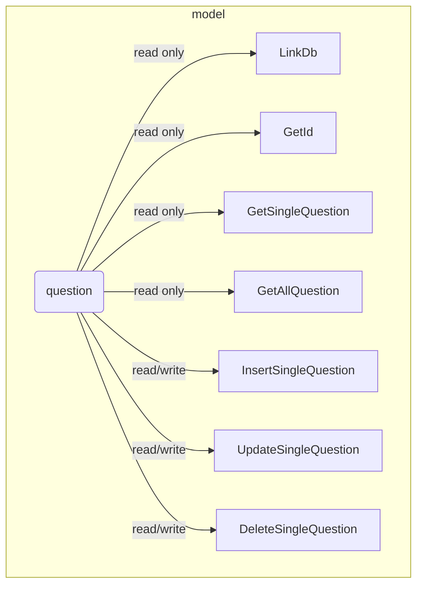

考题录题出题系统

```mermaid
graph TB
subgraph model
sqlite3(question)-->|read only|LinkDb
sqlite3(question)-->|read only|GetId
sqlite3(question)-->|read only|GetSingleQuestion
sqlite3(question)-->|read only|GetAllQuestion
sqlite3(question)-->|read/write|InsertSingleQuestion
sqlite3(question)-->|read/write|UpdateSingleQuestion
sqlite3(question)-->|read/write|DeleteSingleQuestion
end
```

